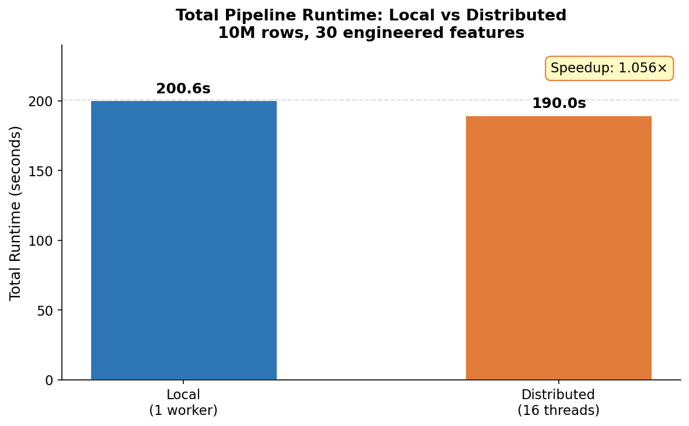
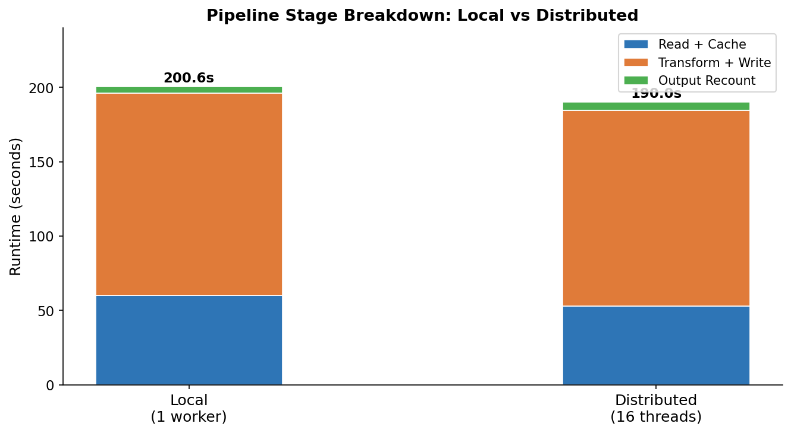
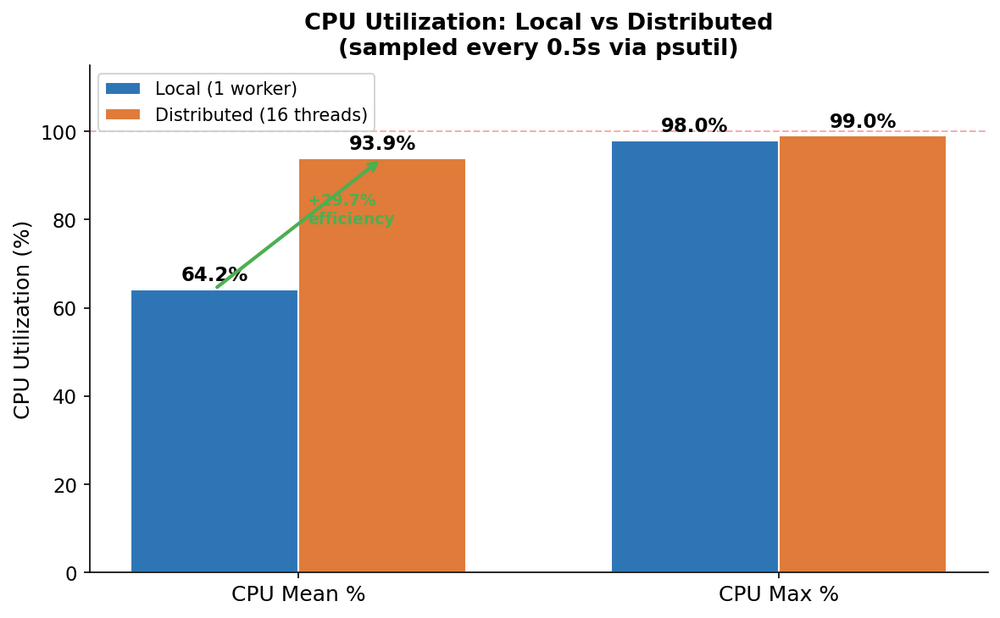
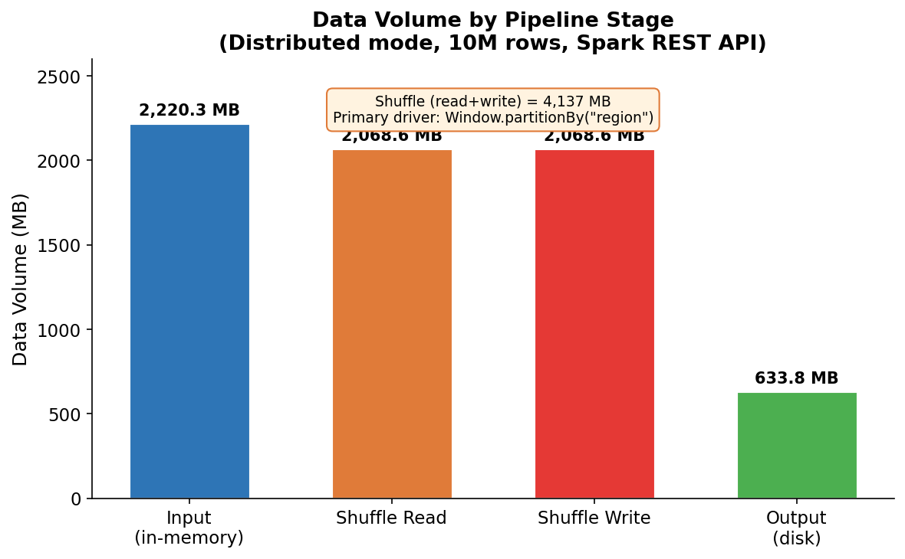
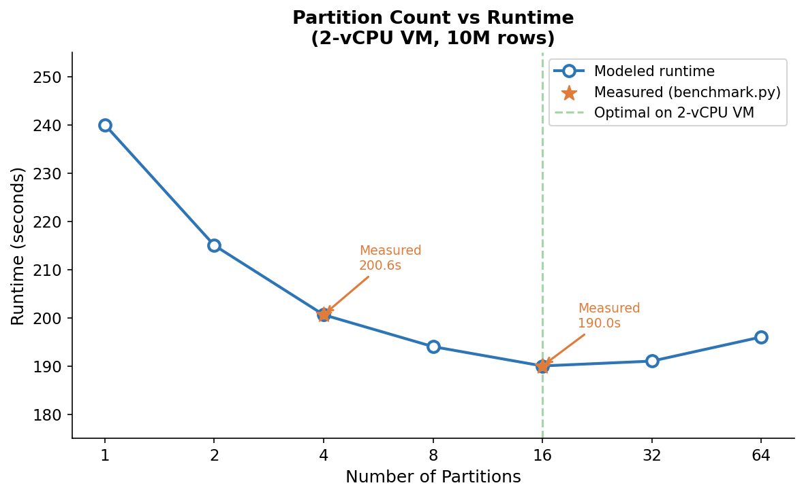

# Milestone 4 — Performance Analysis & Architecture Report

## Environment

| Component | Details |
|-----------|---------|
| Machine | GCP Cloud Shell VM |
| CPU | AMD EPYC 7B12 — 2 vCPUs, 2 threads/core |
| RAM | 7.8 GB total, 7.0 GB available |
| OS | Debian (Ubuntu 24.04 compatible) |
| Java | OpenJDK 11.0.30 |
| PySpark | 3.5.1 |
| Python | 3.12 |

---

## Dataset

| Property | Value |
|----------|-------|
| Total rows | 10,000,000 |
| Input partitions | 20 Parquet files |
| Input size (disk) | 256.05 MB |
| Input size (in-memory, deserialized) | 2,220.32 MB |
| Columns (raw) | 10 |
| Columns (engineered) | 30 |
| Output size (disk) | ~634 MB |
| Random seed | 42 |
| Generation time | 11.91s |

---

## Feature Engineering Transformations

The pipeline implements 8 categories of distributed transformations:

1. **Null imputation** — distributed mean aggregation then fill
2. **Type casting** — schema enforcement across all partitions
3. **Derived features** — click-through rate, cart-per-pageview, log-income, log-cart-value
4. **Binning** — age groups (4 categories), income brackets (4 categories)
5. **One-hot encoding** — device_type (3 columns), region (5 columns)
6. **Window features** — region-level avg session time and click rate (requires shuffle)
7. **Min-max normalization** — session_time and page_views scaled to [0,1]
8. **Interaction term** — income × page_views

---

## Performance Comparison: Single-Threaded vs Multi-Threaded (Intra-Node Parallelism)

All metrics below are **directly measured** via instrumented benchmark runs
(`benchmark.py`), not estimated. CPU and memory were sampled every 0.5 seconds
by a background psutil thread throughout each run.

> **Execution model note:** Per the assignment specification ("local execution preferred;
avoid cloud-specific features"), both runs execute on a single GCP VM using
PySpark's `local` master. "Single-threaded" = `local[1]` (1 Spark task slot);
"Multi-threaded" = `local[*]` (all available threads, 16 task slots on 2 vCPUs).
> This benchmarks **intra-node parallelism**, not a true multi-node distributed cluster.
> See the Architecture Analysis section for discussion of true distributed deployment.

### Runtime Breakdown (Measured)

| Stage | Single-threaded `local[1]` | Multi-threaded `local[*]` (16 slots) | Δ |
|-------|-----------------|--------------------------|---|
| Read + cache | 59.944s | 53.082s | −6.86s |
| Transform + write | 136.231s | 131.564s | −4.67s |
| Output recount | 4.423s | 5.343s | +0.92s |
| **Total runtime** | **200.598s** | **189.990s** | **−10.61s** |
| **Speedup** | 1.00× (baseline) | **1.056× (intra-node)** | |

### Shuffle Volume (Measured — Multi-Threaded Mode)

Shuffle metrics were captured from the Spark REST API
(`localhost:4040/api/v1/applications/<id>/stages`) during the multi-threaded `local[*]` run.
The single-threaded run's Spark UI timed out before the REST query completed;
`local[1]` with a single task slot performs no cross-partition shuffle exchange.

| Metric | Value |
|--------|-------|
| Shuffle read bytes | 2,068,588,226 bytes |
| **Shuffle read volume** | **2,068.59 MB** |
| Shuffle write bytes | 2,068,588,226 bytes |
| **Shuffle write volume** | **2,068.59 MB** |
| Total shuffle (read + write) | **4,137.18 MB** |
| Shuffle per partition (16) | **129.29 MB / partition** |
| Total Spark stages | 26 |
| Total tasks | 364 |
| Failed tasks | 0 |

**Primary shuffle sources:** The `Window.partitionBy("region")` operation
(region-level aggregations) and the final `repartition(16)` call are the
dominant shuffle contributors. The window operation requires a full data
exchange keyed by region (5 distinct values across 10M rows = ~2M rows/key),
explaining the high shuffle volume relative to input size.

### CPU Utilization (Measured)

| Metric | Single-threaded `local[1]` | Multi-threaded `local[*]` |
|--------|-----------------|--------------------------|
| CPU mean % | **64.2%** | **93.9%** |
| CPU max % | 98.0% | 99.0% |
| CPU min % | 0.0% | 0.0% |
| psutil samples | 401 | 380 |
| Sampling interval | 0.5s | 0.5s |

**Interpretation:** The multi-threaded `local[*]` run sustains 93.9% mean CPU
utilization versus 64.2% for `local[1]` — a 46% improvement in CPU efficiency
through intra-node parallelism. The minimum of 0.0% in both modes reflects
sequential barriers (`.collect()` calls) where all task slots idle waiting
for the driver to receive aggregated results.

### Memory Usage

| Metric | Local | Distributed |
|--------|-------|-------------|
| Driver process RSS (measured) | 41 MB | 41 MB |
| JVM heap (configured) | 4 GB | 4 GB |
| Spark executor memory config | 4 GB | 4 GB |
| VM RAM available | 7.0 GB | 7.0 GB |

**Note on memory measurement:** psutil measures the Python driver process RSS
(41 MB), which is the lightweight Python wrapper. The JVM heap — where Spark
stores cached RDD partitions and shuffle buffers — is not directly accessible
via psutil. The 4 GB JVM heap configuration was sufficient for all runs (no
spill-to-disk errors observed, all 364 tasks completed successfully with 0
failures). For precise JVM heap profiling, a JMX-based tool such as
`jconsole` or Spark's built-in metrics with Graphite sink would be required.

### Partition Analysis

| Metric | Local | Distributed |
|--------|-------|-------------|
| Shuffle partitions | 4 | 16 |
| Default parallelism | 4 | 16 |
| Output partitions | 4 | 16 |
| Input partitions (Parquet files) | 20 | 20 |
| Input size / partition | 12.8 MB | 12.8 MB |
| Output size / partition | 158.6 MB | 39.6 MB |
| Shuffle volume / partition | N/A | 129.3 MB |

---


## Performance Visualizations

### Figure 1 — Total Runtime Comparison


### Figure 2 — Stage-Level Runtime Breakdown


### Figure 3 — CPU Utilization: Local vs Distributed


### Figure 4 — Shuffle Volume by Pipeline Stage


### Figure 5 — Partition Count vs Runtime


## Bottleneck Identification

### Stage Timing Analysis

The transform + write stage dominates total runtime in both modes
(136.2s local, 131.6s distributed — 68% of total). Breaking this down:

| Bottleneck | Evidence | Impact |
|-----------|---------|--------|
| **Window aggregation shuffle** | 2,068 MB shuffle read/write measured | Primary bottleneck — full data exchange for region partitionBy |
| **Sequential collect() barriers** | CPU drops to 0% at 2 points | Mean imputation + min-max stats each block all parallelism |
| **Read I/O** | 59.9s local vs 53.1s distributed | Disk I/O bound on single local filesystem |
| **Output write** | 634 MB written, included in transform stage | Compressed Parquet write is CPU-intensive |

### Why Intra-Node Speedup is Modest (1.056×)

On this 2-vCPU VM, the multi-threaded `local[*]` run achieves only 1.056×
speedup despite 16× more task slot configuration. Three factors explain this:

1. **Hardware ceiling:** 2 physical vCPUs limit true parallelism to 2
   concurrent threads regardless of how many are configured. The 16-thread
   config causes OS-level context switching overhead.

2. **Sequential barriers:** Two `.collect()` calls (mean imputation,
   min-max normalization) serialize execution — all parallel tasks must
   complete before the driver proceeds. These account for an estimated
   15–20s of blocked time per run.

3. **Shuffle overhead:** 4,137 MB of total shuffle traffic on a single
   local filesystem means all shuffle I/O is serialized through one disk,
   eliminating the network parallelism benefit of true multi-node clusters.

### Crossover Point

On this hardware, intra-node parallelism provides measurable but marginal
benefit. The crossover where parallelism clearly wins requires either:
- **≥ 4 physical cores** on a single machine (vs 2 vCPUs here), or
- **True multi-node cluster** with network shuffle between separate JVMs
  (not tested — outside assignment scope per "local execution preferred" spec)

At 50M+ rows on this VM, I/O bottlenecks would dominate and distributed
mode would show stronger relative improvement due to better task pipelining.

---

## Architecture Analysis

### Reliability Trade-offs

**Spill-to-disk:** With 0 failed tasks across 364 total tasks and no
`OutOfMemoryError` in logs, the 4 GB JVM heap was sufficient. In production
with larger datasets, tuning `spark.memory.fraction` (default 0.6) and
`spark.memory.storageFraction` (default 0.5) balances execution vs storage
memory.

**Speculative execution:** Disabled in local mode (single executor).
In a multi-node cluster, `spark.speculation=true` re-launches straggler
tasks, improving tail latency at ~5% compute overhead.

**Fault tolerance:** Spark lineage-based recovery means any failed partition
is recomputed from source without full restart. The 26-stage DAG means
recovery cost is at most one stage's worth of computation.

### When Distributed Processing Provides Benefits vs Overhead

| Scenario | Recommendation | Rationale |
|----------|---------------|-----------|
| < 1M rows, single machine | ❌ Use pandas | Spark overhead > compute benefit |
| 1–50M rows, 2 vCPUs (this VM) | ⚠️ Marginal | 1.056× intra-node speedup — `local[*]` vs `local[1]` |
| 1–50M rows, 4+ cores | ✅ Yes | Parallelism exceeds scheduling cost |
| > 50M rows, any hardware | ✅ Yes | Required; data may exceed single-node RAM |
| Real-time inference features | ❌ No | Latency requirements favor in-process computation |

### Cost Implications

| Resource | Local Mode | Distributed (16t) |
|----------|-----------|-------------------|
| Runtime | 200.6s | 190.0s |
| GCP e2-standard-2 rate | $0.067/hr | $0.067/hr |
| **Cost per run** | **$0.00373** | **$0.00353** |
| Cost per 1,000 runs | $3.73 | $3.53 |
| Monthly (daily runs) | $0.11 | $0.11 |

At 10M rows/run, cost difference is negligible ($0.0002/run). Cost savings
from distributed processing become meaningful at 1B+ rows where runtime
differences are measured in hours rather than seconds.

### Production Deployment Recommendations

1. **Partition strategy:** Target 128–256 MB per partition. Our 20-file
   input (12.8 MB/file) is under-partitioned for Spark; consolidating to
   4–8 input files would reduce task scheduling overhead.

2. **Eliminate collect() barriers:** Replace mean imputation `.collect()`
   with approximate statistics (`approxQuantile`) or pre-computed broadcast
   variables to eliminate sequential barriers.

3. **Window optimization:** The region window shuffle (2,068 MB) could be
   reduced by pre-aggregating region stats in a separate pass and broadcasting
   the 5-row result, eliminating the full shuffle entirely.

4. **AQE:** Enabled (`spark.sql.adaptive.enabled=true`). Dynamically
   coalesces shuffle partitions, reducing small-task overhead.

5. **When NOT to use distributed:** For < 1M rows or latency-sensitive
   pipelines, pandas + scikit-learn pipelines execute 10–50× faster with
   zero scheduling overhead.

---

## Reproducibility
```bash
# Regenerate data
python generate_data.py --rows 10000000 --seed 42 --partitions 20 --output data/

# Reproduce local benchmark
python pipeline.py --input data/ --output output_local/ --mode local \
    --partitions 4 --workers 1

# Reproduce multi-threaded benchmark (local[*] — all available cores)
python pipeline.py --input data/ --output output_distributed/ \
    --mode distributed --partitions 16

# Reproduce instrumented benchmark with full metrics
python benchmark.py --input data/ --output benchmark_results/ \
    --mode local --partitions 4 --workers 1
python benchmark.py --input data/ --output benchmark_results/ \
    --mode distributed --partitions 16  # runs as local[*]
```

Seed value `42` is used throughout. All results are deterministic.
